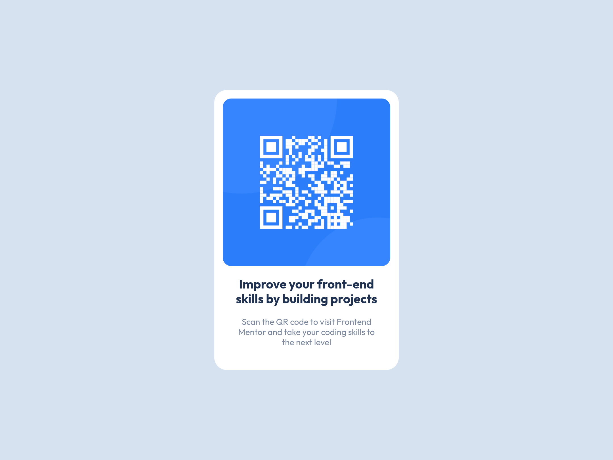

# Frontend Mentor - QR code component solution

This is a solution to the [QR code component challenge on Frontend Mentor](https://www.frontendmentor.io/challenges/qr-code-component-iux_sIO_H). Frontend Mentor challenges help you improve your coding skills by building realistic projects.

## Table of contents

- [Overview](#overview)
  - [Screenshot](#screenshot)
  - [Links](#links)
- [My process](#my-process)
  - [Built with](#built-with)
  - [Continued development](#continued-development)
- [Author](#author)

**Note: Delete this note and update the table of contents based on what sections you keep.**

## Overview

### Screenshot

### Links

- [Solution Page]()
- [Live Site]()

## My process

### Built with

- Semantic HTML5 markup
- CSS custom properties
- CSS Grid
- Mobile-first workflow
- [Vite](https://vitejs.dev/)

### Continued development

I experimented with organizing CSS into separate files and using `@import` to consolidate, may continue to refine this workflow.

## Author

- Website - [newtjam.com](https://newtjam.com)
- Frontend Mentor - [@newtjam](https://www.frontendmentor.io/profile/newtjam)
- Twitter - [@itsnewtjam](https://www.twitter.com/itsnewtjam)
